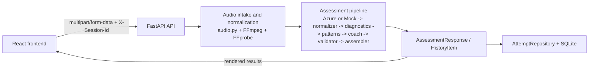
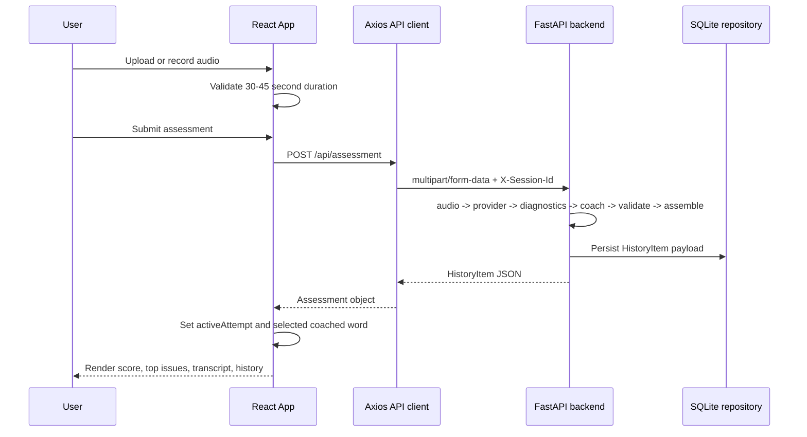

# PronounceAI

PronounceAI is a full-stack pronunciation assessment app for short English recordings. It supports browser recording, file upload, word-level issue highlighting, AI coaching, anonymous session history, and DPDP-aware data handling.

## Stack

- Frontend: React, TypeScript, Vite, TanStack Query, Axios
- Backend: FastAPI, SQLAlchemy, Pydantic Settings
- Audio pipeline: FFmpeg / FFprobe
- Providers: Azure Speech, Groq, database via `DATABASE_URL`

## High-Level Architecture



## Frontend Rendering Flow




## Local Setup

### Frontend

```powershell
cd frontend
npm install
npm run dev
```

### Backend

```powershell
python -m venv .venv
.\.venv\Scripts\Activate.ps1
pip install -r backend\requirements.txt
uvicorn backend.app.main:app --reload --host 0.0.0.0 --port 8000
```

## Production Deployment

### Backend on Railway (Docker)

This repository includes a production-ready Dockerfile for Railway.

- Build/start command inside container:
	- `uvicorn backend.app.main:app --host 0.0.0.0 --port ${PORT}`
- FFmpeg is installed in the container and detected from `PATH` at app startup.
- SQLite defaults to `/data/pronounceai.db` through `DATABASE_URL`.

### Frontend on Vercel

- Framework preset: `Vite`
- Build command: `npm run build`
- Output directory: `dist`
- Set `VITE_API_BASE_URL` to your Railway backend URL plus `/api`.
- Browser microphone capture requires HTTPS in production (secure context).

## Environment

Copy `.env.example` to `.env` and fill in values. The backend runs in mock mode by default so the product can work end-to-end before Azure or Groq keys are added.

For the real provider path:

- Set `ENABLE_MOCK_ANALYSIS=false`
- Add Azure Speech and Groq keys to `.env`

## Notes

- FFmpeg and FFprobe should be available on the server `PATH`
- Raw audio is written to temp storage only for processing and deleted afterwards
- Attempt history retains transcripts, scores, and coaching payloads for up to 90 days by default
- Azure Speech is configured for Central India via `AZURE_SPEECH_REGION=centralindia`
- Groq receives transcript and diagnostic context for coaching-text generation and should be disclosed as a separate processor in privacy/compliance materials

## Required Environment Variables

Backend (Railway):

- `APP_ENV=production`
- `CORS_ORIGINS=https://<your-frontend-domain>`
- `DATABASE_URL=sqlite:////data/pronounceai.db`
- `ENABLE_MOCK_ANALYSIS=false` (for real provider mode)
- `AZURE_SPEECH_KEY=<your-azure-key>`
- `AZURE_SPEECH_REGION=centralindia`
- `GROQ_API_KEY=<your-groq-key>`
- `GROQ_MODEL=llama-3.3-70b-versatile`
- `FFMPEG_BINARY=ffmpeg`
- `FFPROBE_BINARY=ffprobe`

Frontend (Vercel):

- `VITE_API_BASE_URL=https://<your-railway-backend-domain>/api`

## Railway Deployment Checklist

- Push repository with `Dockerfile` and `.dockerignore`.
- Create Railway service from GitHub repository.
- Configure all backend environment variables listed above.
- Ensure Railway volume is mounted at `/data`.
- Confirm health endpoint: `GET /health`.
- Confirm startup logs show:
	- environment
	- database path
	- scheduler status
	- Azure configured
	- Groq configured
- Confirm CORS allows only your frontend domain.
- Confirm retention scheduler runs and shuts down cleanly on deploy restarts.

## Vercel Deployment Checklist

- Import `frontend` project in Vercel.
- Set framework preset to Vite.
- Set build command to `npm run build`.
- Set output directory to `dist`.
- Set `VITE_API_BASE_URL` to Railway backend `/api` URL.
- Add production domain in Vercel.
- Verify microphone works on deployed HTTPS domain.
- Verify analysis, history, and delete flows work end to end.

## Required DNS Records

Typical setup (replace with your provider values):

- Frontend root domain:
	- `A` record for `@` -> Vercel IP target (as shown by Vercel)
- Frontend subdomain:
	- `CNAME` record for `www` -> `cname.vercel-dns.com`
- Optional backend custom domain on Railway:
	- `CNAME` record for `api` -> Railway provided target hostname

After DNS setup, update:

- `VITE_API_BASE_URL` to `https://api.<your-domain>/api` (if using backend custom domain)
- `CORS_ORIGINS` to your final frontend domain
